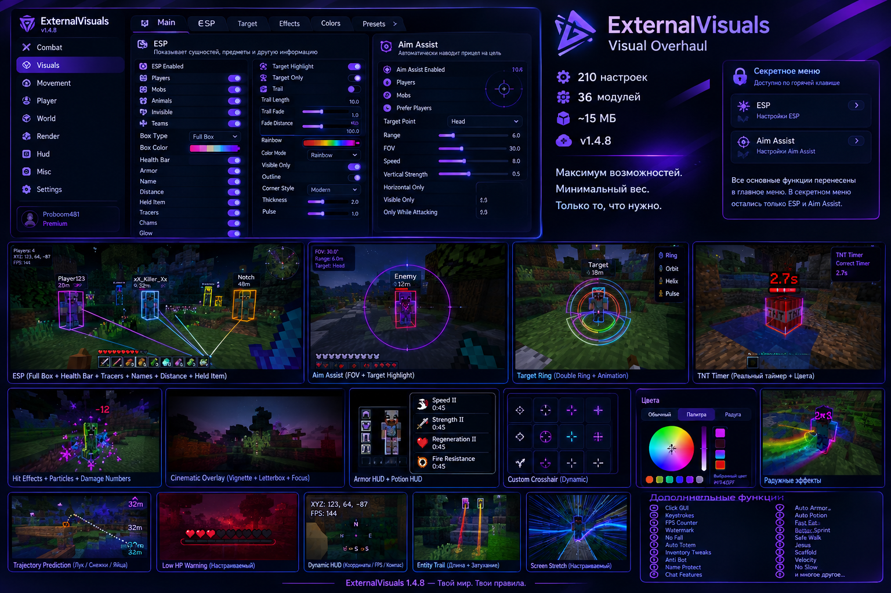
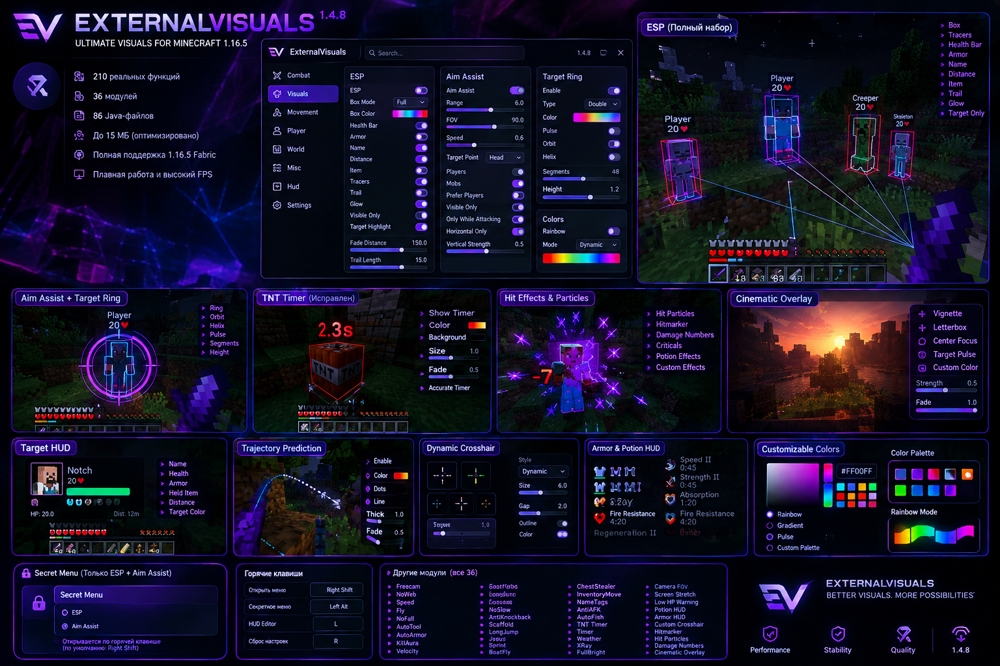

# ExternalVisuals 1.5.1 — Visual Preview

These concept previews show the intended visual direction: dark AMOLED/glass panels, neon purple accent, compact module cards, advanced ESP, target ring, TNT timer, HUD widgets, particles, trajectory and cinematic overlays.

> The previews are design references for the mod UI, not screenshots of a running Minecraft client.

## Overview

## Menu + Visual Systems

